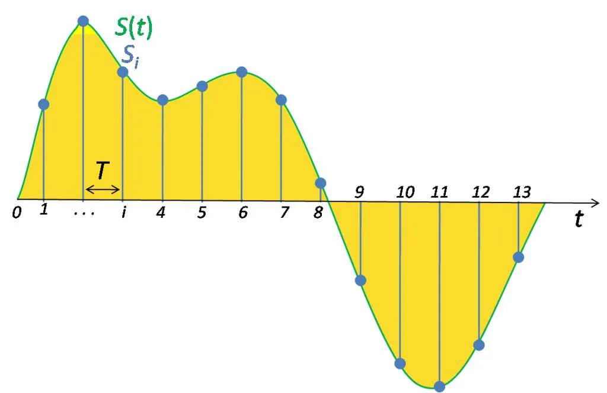

# BirdCLEF 2024

## To Identify Bird Species from their Sounds

## Provided Data

* **train_audios**: Contain 182 folders, each folder contain multiple audio files of particular bird species.
* **train_metadata.csv**: Contain metadata of each audio file.
* **unlabeled_soundscapes**: Contain multiple audio files of bird sounds.
* **eBIrd_Taxonomy_v2021.csv**: Data on the relationships between different species.
* **test_soundscapes**: Only the hidden rerun copy of the test soundscape dirctory will only be populated.
* **SampleSubmission.csv**: A sample submission file in the correct format. First column is the filename, and remaining are scores for each bird species.

## Evaluation Metric

* A version of macro-averaged ROC-AUC that skips classes which have no true positive labels.

## Dataset Info

* train audio are in different length and sample rate is 32000
* If an audio is for 6 second, when you read with soundfile, it will be 6*32000 = 192000 samples
* So the size of array will be (192000,)
* Since we have to predict for each 5 second, we will split the audio into 5 second.
* Now, will select one of the 5 second audio and convert it into melspectrogram of shape (3, 128, 201)
* When we make batch of it the shape will be (bs, 3, 128, 201)
* Model will give output of shape (bs, num_classes), i.e. (bs, 182)

## Status

1. Setup local evaluation for the competition metric
2. Do more EDA on the available data
3. Apply augmentation in the next submission.

# To Learn

## 1. What is an audio?

To digitize a sound wave we must turn the signal into a series of numbers so that we can input it into our models. This is done by measuring the amplitude of the sound at fixed intervals of time.

Each such measurement is called a sample, and the sample rate is the number of samples per second. For instance, a common sampling rate is about 44,100 samples per second. That means that a 10-second music clip would have 441,000 samples!

## 3. How to preprocess audio data?

# Pipeline

## 1. Data Preprocessing

1. Read the meta data dataframe
2. Split the data into train and valid
3. Add a column for path of the audio file
4. Use this dataframe to convert audio to image

## 2. Convert Audio to Image

1. Read an audio file using soundfile.read method
2. Chop the audio file into multiple audio files of 5 second each
3. Convert all the audio files to spectrogram
4. Stack all the images using numpy
5. Save the image to disk

## 3. Creating Dataset and Dataloader

1. Use train and valid dataframe to create a dataset
2. Read the row of the dataframe
3. Load the corresponding saved numpy file with custom max number of images
4. While training select one of the image randomly
5. Convert to tensor, augmentate it
6. Stack 2 duplicate images to make it 3 channel
7. Normalize the image
8. Create a batch of 64 images to pass it to model.

## 4. Model and Training

1. Using tf_efficientnet_b0_ns model from timm
2. Take a batch of images and target.
3. If mixup is true, calculate mixup loss else calculate normal loss

## 5. Resources

1. Convert Audio To Spectrogram: <https://www.kaggle.com/code/nischaydnk/split-creating-melspecs-stage-1>
2. Pytorch Lightning Inferece: <https://www.kaggle.com/code/nischaydnk/birdclef-2023-pytorch-lightning-inference>
3. Pytorch LIghtning training: <https://www.kaggle.com/code/nischaydnk/birdclef-2023-pytorch-lightning-training-w-cmap>
4. Audio Deep Learning: <https://www.kaggle.com/competitions/birdclef-2024/discussion/491668>
